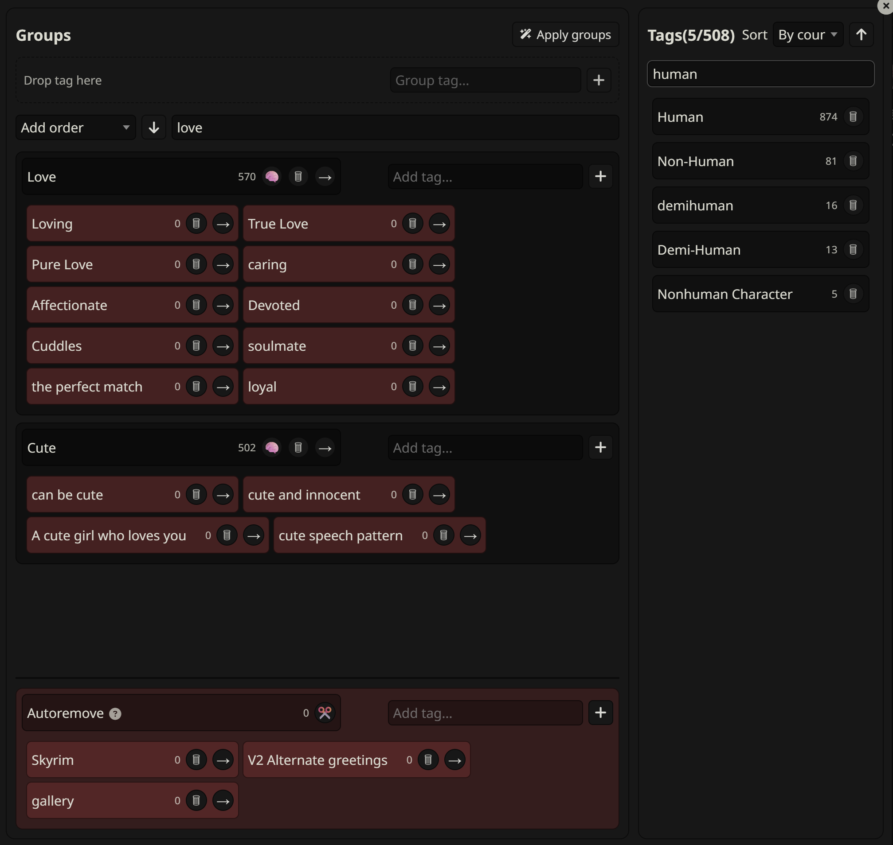
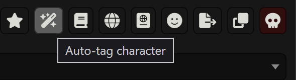

# SillyTavern Tag Manager

Helps you organize your character tags with optional LLM support.

## Features

* Organize your tags into groups of similar meanings, then automatically reduce all of those tags to single tag.
* Automatically tag characters with LLM suggestions
* Autoremove meaningless tags (as defined by user)
* Add tags with less than X occurences to autoremove quickly

## Installation and Usage

### Installation

Copy url of this repository into "Install extension" modal of SillyTavern.

### Usage

All LLM calls use default connection and need Chat Completion API.

#### Organizing tags

You can access main group tag manager in one of thee ways:
* button in settings
* button next to original "Manage tags" button
* command /tag-organizer

This window is split in unassigned tags (on the right), and ta groups (on the left).

You can create a new tag group by dragging a tag into top section (marked "Drop tag here") or by finding it in "Group tag..." search box.
Once a group is created you can drag other tags inside, or add tags using "Add tag..." search box.

The tags in a group will be later converted into the grouping tag. For example if you make group "Dog" and assign to it "man's best friend", "doggie", "puppy", once you commit changes all nested tags will be converted to "Dog".

Those changes don't do anythign to tags on your characters, so don't worry if you make mistakes.

Once you have a tag group you can click brain icon next to it's header to generate LLM suggestions for what tags should be inside(you will have confirmation window before they are added, suggestion quality depends on model).

There is also special group called "Autoremove", where you can move tags you only want removed from characters, usually because they don't have any meaning. You can click scissors icon to add tags with less than X uses to this group, which helps prune rare tags with just few clicks. (The tags won't be removed from the system yet).

Once you're happy with your configuration click "Apply groups" at the top. This will unify all configured tags and remove all tags from autoremove. Sub-tags from groups will also be removed. You don't need to assign all tags to groups - unassigned tags won't be affected by any changes.

Once tags are removed from the system they will still be visible in group tag configuration. If you import more characters with "puppy" and "doggie" tags you can click "Apply groups" again to assign them to "Dog" again, without needing to reconfigure every time. Tags missing in the system are marked red, while tags still in system are dark.

#### Auto-tagging character

Click wand button in character data page, choose how many tags you want, and whenever LLM can remove existing tags and click "Run".

After suggestions are generated you'll get a window where you can see the results before saving them. If you don't like some of suggestions click "R" next to that suggestion to move it into "removed tags" section. Click save, when you're done.

NOTE: This will send all of character definitions to the LLM along with list of all your tags. If you have thousands of tags and huge character you will need context big enough to hold all of that in. I suggest organizing your tags first if this is a problem.

## Prerequisites

Tested on SillyTavern 1.16.0. Use of Chat Completion API.

## Support and Contributions

For support create an issue on github.

## License

MIT License